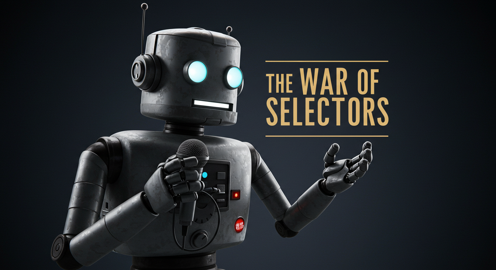

    Preview do podcast

    <audio src="output/podcast_editado.MP3" controls title="Podcast editado"></audio>

# A Guerra dos Selectores - Podcast Gerado por I.A.s

> ℹ️ **Nota:** Este repositório documenta meu processo de criação do podcast **“A Guerra dos Selectores”**, usando ferramentas de inteligência artificial para roteiro, capa e narração.

Criei este projeto como um experimento pessoal, integrando **ChatGPT, ImageFX e Text-to-Speech** para gerar cada etapa do podcast de forma criativa e automatizada.

## 💻 Ferramentas utilizadas

- [ChatGPT](https://chat.openai.com/) – Para gerar títulos e roteiro do episódio.
- [ImageFX](https://imagefx.com/) – Para criar a arte da capa do podcast.
- [Text-to-Speech Online] – Para gerar a narração do episódio a partir do roteiro.
- [Capcut](https://www.capcut.com/pt-br/) – Para tratar o áudio e adicionar efeitos sonoros.

## ✨ Como foi o meu processo

- **Roteiro:** Usei o ChatGPT para criar um roteiro completo, voltado para iniciantes em front-end, com introdução, curiosidades sobre CSS, dicas de ferramentas e finalização simpática. Ajustei a linguagem para ser acessível, fluida e com toques de humor nerd.  
- **Capa:** Criei a arte no ImageFX, com estilo cinematográfico de Star Wars. O personagem segurando um sabre de luz feito de código CSS e um fundo digital cósmico com grids, botões e pixels flutuando.  
- **Narração:** Transformei o roteiro em áudio usando text-to-speech online, ajustando pausas e entonação para tornar a narração natural e engajante.  
- **Finalização:** Combinei a narração com efeitos sonoros e o áudio final no Capcut.

## 📚 Materiais e referências

- [Notion com prompts utilizados](https://helpful-jump-17b.notion.site/PAS-Podcast-AI-Studio-210489e15d7a4a73b743bb159e45d06f?pvs=4)  
- [Editor de áudio Capcut](https://www.capcut.com/editor?from_page=landing_page)

## 🛠️ Meu fluxo de criação

1. Gere os **títulos e roteiro** com ChatGPT e selecionei as melhores opções.  
2. Criei a **arte da capa** com ImageFX, definindo estilo e cores.  
3. Transformei o **roteiro em áudio** usando Text-to-Speech Online.  
4. Ajustei o áudio e adicionei efeitos sonoros no Capcut.  
5. Combinei todos os elementos para gerar o episódio final do podcast.

## 👨‍💻 Sobre mim

    
    
&nbsp&nbsp&nbspFelipe de Lima Passarelli 
    &nbsp&nbsp&nbsp
    <a 
        href="https://github.com/felipelp">
        GitHub
    </a>
    &nbsp;|&nbsp;
    <a 
        href="https://www.linkedin.com/in/felipe-passarelli/">
        LinkedIn
    </a>
    &nbsp;|&nbsp;
    <a 
        href="https://www.instagram.com/feshowh/">
        Instagram
    </a>
    &nbsp;|&nbsp;

  

---

⌨️ com 💜 por [Felipe de Lima Passarelli](https://github.com/felipelp)
